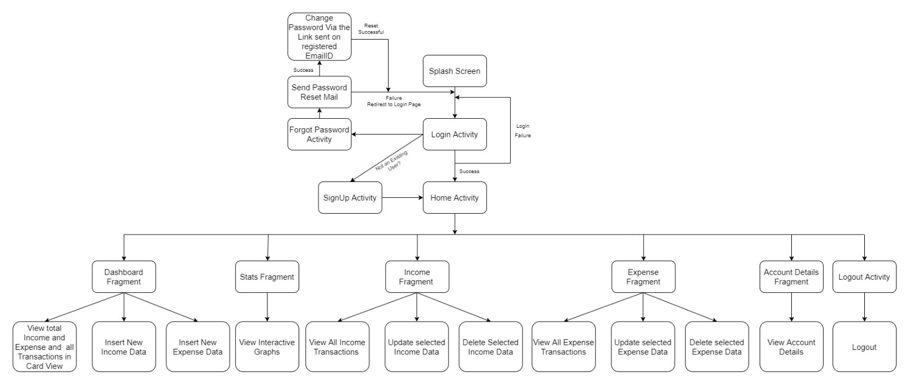

# FinTrack

A personal finance platform developed in Android Java.

## Overview

FinTrack is a comprehensive personal finance platform that aggregates financial data from various sources. It offers features such as budget tracking, expense categorization, investment portfolio analysis, and financial goal planning.

## Features

1. **Budget Tracking:**
   - Set budgets for different categories.
   - Real-time tracking of expenses against the set budgets.

2. **Expense Categorization:**
   - Automatic or manual categorization of expenses.
   - Detailed insights into spending patterns for each category.

3. **Investment Portfolio Analysis:**
   - Integration with financial APIs or platforms.
   - Visualize the performance of various investments.

4. **Financial Goal Planning:**
   - Set short-term and long-term financial goals.
   - Progress tracking and alerts to stay on target.

5. **Financial Data Aggregation:**
   - Integration with various financial sources.
   - Secure handling of sensitive financial information.

6. **User Authentication and Security:**
   - Secure user authentication.
   - Encryption for user privacy.

7. **Reports and Analytics:**
   - Generate detailed reports and analytics.
   - Visual representations of income, expenses, and savings.

8. **Notification System:**
   - Alerts and reminders for upcoming bills and goals.
   - Customizable notification preferences.

9. **User-Friendly Interface:**
   - Intuitive design for an enhanced user experience.
   - Easy navigation and accessibility.

10. **Data Export/Import:**
    - Export or import financial data for backup or transfer.

## Future Enhancements

Consider future enhancements like:
- Machine learning for expense predictions.
- Personalized financial advice.
- Integration with digital wallets and payment platforms.

## Security

Ensure compliance with data protection regulations and implement robust security measures to protect user information.

## Feedback

We welcome user feedback for continuous improvement. Regular updates will be made to enhance the application based on user needs.

## License

This project is licensed under the [MIT License](LICENSE).

---

**Note:** Please replace `[LICENSE]` with the actual name of the license file, if applicable.

